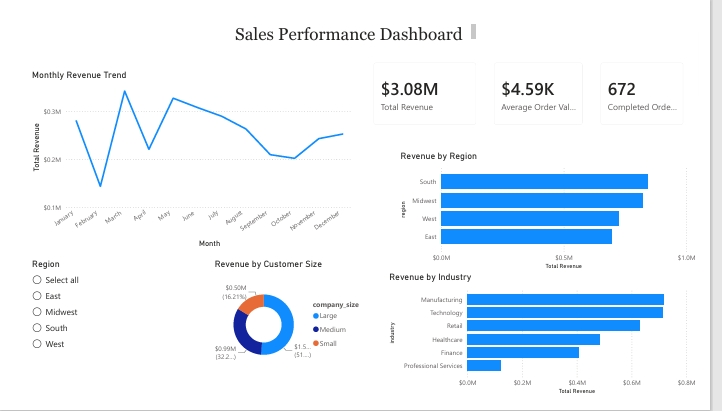

# Sales Performance Dashboard

## Project Summary

Developed a sales analytics solution using SQL and Power BI to analyze customer transactions, revenue trends, and business performance metrics. Created an interactive dashboard that transforms raw sales data into actionable insights.

## Tools Used

- SQL
- SQLite
- Power BI
- Data Visualization
- Dashboard Development

## SQL Skills Demonstrated

- SELECT Statements
- Filtering (WHERE)
- Sorting (ORDER BY)
- Aggregations (SUM, AVG, COUNT)
- GROUP BY
- Joins
- Business Metrics Analysis

## Dashboard Features

- Revenue Trend Analysis
- Customer Performance Analysis
- Sales KPI Reporting
- Interactive Filters and Slicers

## Key Findings

- Revenue increased throughout the reporting period.
- A small number of customers generated a large share of total sales.
- Monthly sales trends identified seasonal fluctuations.
- Interactive reporting improved accessibility of business insights.

## Files Included

- Sales_Dashboard.pbix
- sales_database.sql
- PowerBI_Dashboard_Preview.jpeg
